# GitLab

## GitLab basics

GitLab is an online place for your [Git](git.md) repositories,
which also includes several tools to make collaboration with others easier. If you have ever used GitHub or BitBucket,
this is very similar. A main difference is that GitLab is free/open-source software and, as a TUM student,
you have access to the [LRZ GitLab](https://gitlab.lrz.de/), which offers the full range of advanced GitLab features,
groups, private repositories, and more.

## Your user settings

Here are a few changes you may want to make in your user settings:

- **Username:** in your [account](https://gitlab.lrz.de/-/profile/account), change the default cryptic name to something easy to remember and type.
  Your colleagues will want to be able to identify your contributions and tag you in discussions easily.
- **Public avatar:** in your [profile](https://gitlab.lrz.de/-/profile), upload a nice picture to have next to commits and
  discussions you are involved in. This often helps understanding who to talk to.
  If not already set, you may also want to set your real name and set your commit email, so that GitLab understands which contributions come from you.
- **SSH key:** in your [SSH keys](https://gitlab.lrz.de/-/profile/keys), find instructions to generate an SSH key and pair it with GitLab.
  This will allow you to use the `git@gitlab.lrz.de:<project>` links and not have to type your password all the time.
- **Theme and more:** in your [preferences](https://gitlab.lrz.de/-/profile/preferences), choose your own UI colors, set a dark theme,
  choose what your landing page should be, and more.

## Working with issues

Did you find a problem in a project that is hosted on GitLab (like this one)?
Are there several small features you need to implement?
Do you need a structured way to discuss about TODOs with your team?
Then [GitLab issues](https://docs.gitlab.com/ee/user/project/issues/) are the way to document and track all these!

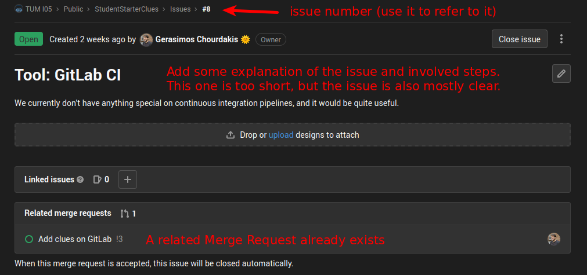

You can add a lot of information on issues: due dates, milestones (e.g. `v1.0.0`, `worksheet1`) and projects/epics (e.g. "redesign the complete UI"), visualize your issues in [issue boards](https://docs.gitlab.com/ee/user/project/issue_board.html) and more.
You can even create [issue templates](https://docs.gitlab.com/ee/user/project/description_templates.html), so that users give you all the information you need. Experiment, now is the best time!

## Working with merge requests

You are working with others on the same code and you are want to contribute a set of changes.
Apart from the short commit message, you would also like to discuss your changes with your colleagues
in a thread and have a code review. This is where merge requests (in GitHub: pull requests) come in.

The general [merge requests workflow](https://docs.gitlab.com/ee/user/project/merge_requests/) is:

1. Fork the repository (if you don't have write access) and create a new branch.
2. Commit your changes and push to your new branch.
3. Start a merge request (GitLab will suggest this after you push) and describe your changes.
4. Look at the file changes and ensure all of them are intended.
5. Optional: Get a code review from someone else. They can see the file changes and add comments directly there.

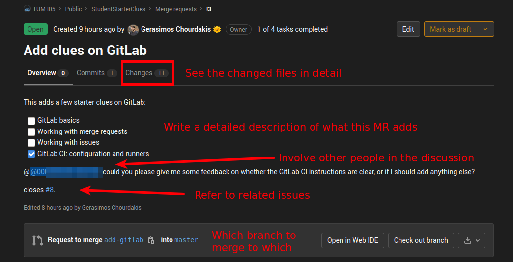

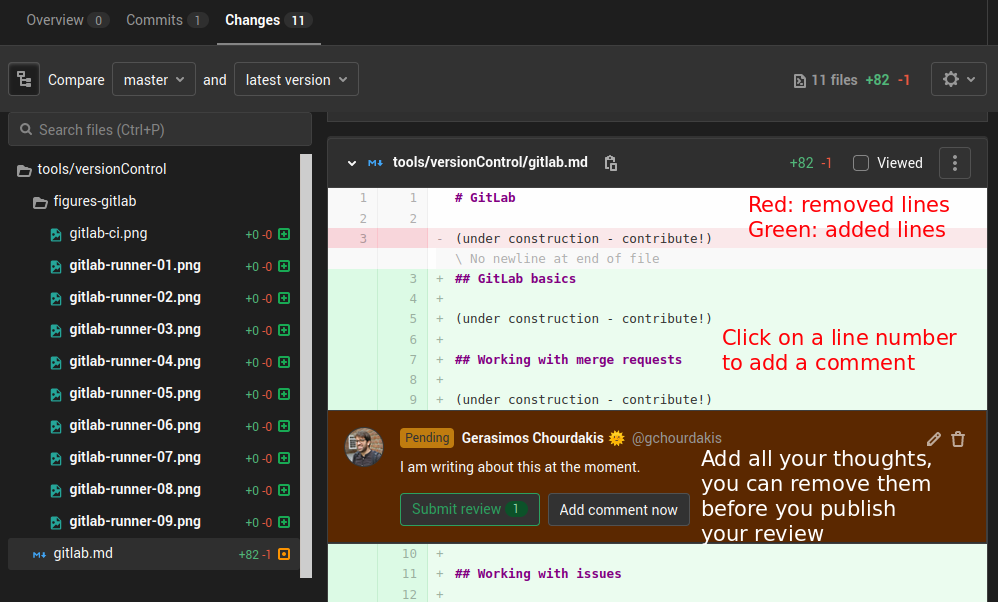

Another guide that only covers the Clone -> Branch -> Merge Workflow for GitHub and GitLab can be found [here](https://www.in.tum.de/fileadmin/w00bws/i05/FG_uploads/Gratl_WorkshopGIT.pdf). You may also find Microsoft's guide [Introduction to GitHub](https://github.com/microsoft/Web-Dev-For-Beginners/tree/main/1-getting-started-lessons/2-github-basics) helpful.

## GitLab CI

Have you been in the situation to argue with your colleagues that "it works on my machine",
yet they are not able to make your project work?
Well, then you need [continuous integration](https://en.wikipedia.org/wiki/Continuous_integration) and here is a CI tool to use as a common truth to this argument!

We show here how to set up a very basic project, but you can do a lot more:
have a look in the [GitLab CI documentation](https://docs.gitlab.com/ee/ci/).

### What tasks to run

To tell GitLab to build our project, we need to add a `.gitlab-ci.yml` [YAML](https://en.wikipedia.org/wiki/YAML) file
in the root directory of our repository. There, we define what platform to use, how to set it up, and which tasks to run in which order and relation to each other. Here is an example:

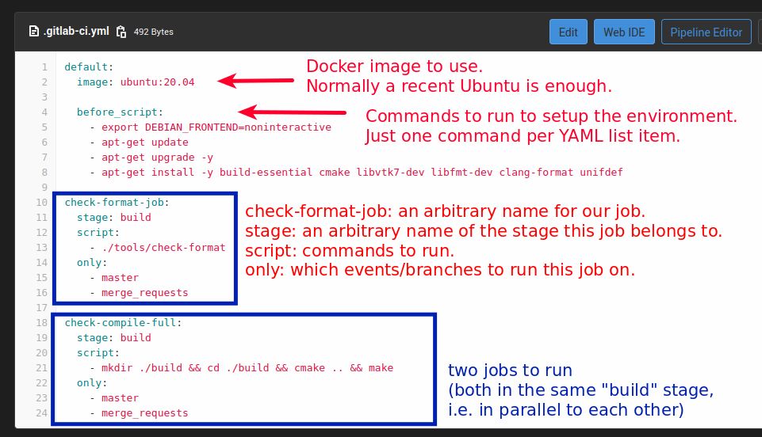

### Where to run them

After you set up your `.gitlab-ci`, you may be wondering what is still goin wrong and
you don't get a nice green "success" symbol next to your commits. Do your jobs seem
to be stuck?

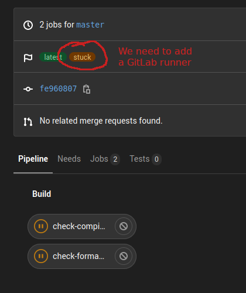

If you click on the job, you get an explanation on why this happens and a link to
your project's CI settings, where you can add a GitLab runner to execute your tests.

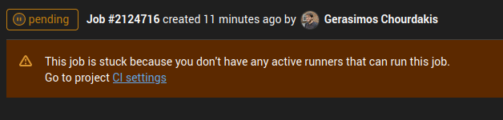

This takes you to a settings page with quite many options. Don't panic, we will
do this together! Note how GitLab guides us to its documentation to add a
_specific runner_.

Unfortunately, LRZ does not provide shared runners (as a security policy),
but we can tell GitLab to run our jobs on our own computer.

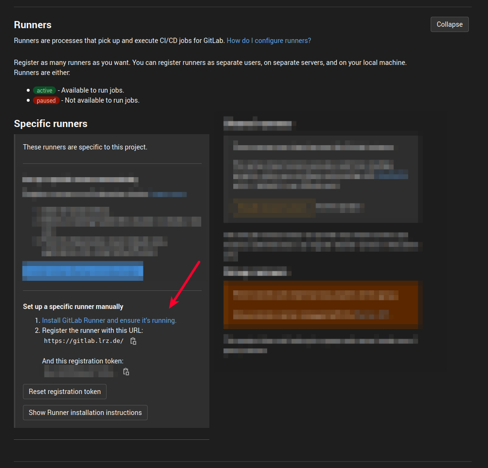

Clicking on the [Install GitLab runner and ensure it's running](https://docs.gitlab.com/runner/install/) link,
we are presented again with quite some options to try.

A nicely isolated/reproducible and yet easy option on various platforms is to
[run GitLab runner in a container](https://docs.gitlab.com/runner/install/docker.html).
This lets us run our build, test, and run workflow on virtually the same system every time, independent of who runs it and where.
Another advantage is that the container cannot directly access the rest of our system, so not much can go wrong.

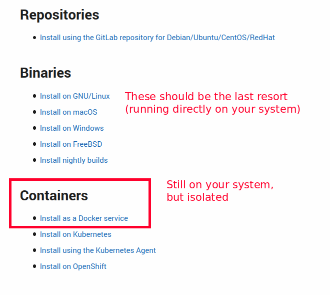

You will need to install [Docker](https://www.docker.com/) (community edition) first, which is relatively easy
and well-documented. Afterwards, we only need to run one command and set a few options.
Just follow the latest documentation on this to setup and register your runner.

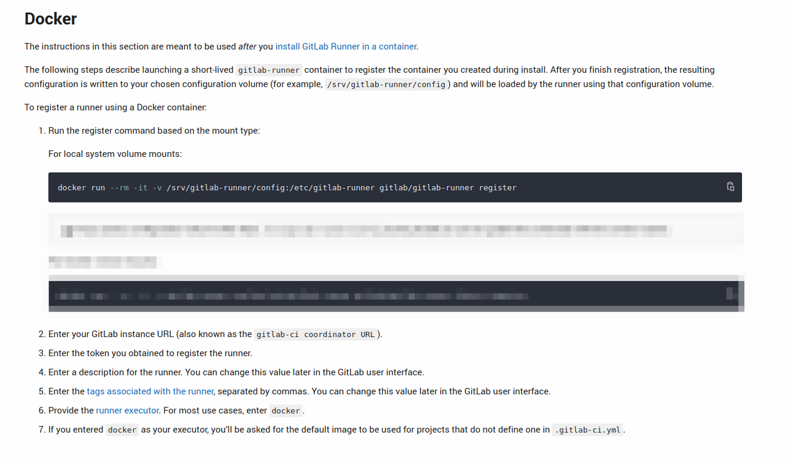

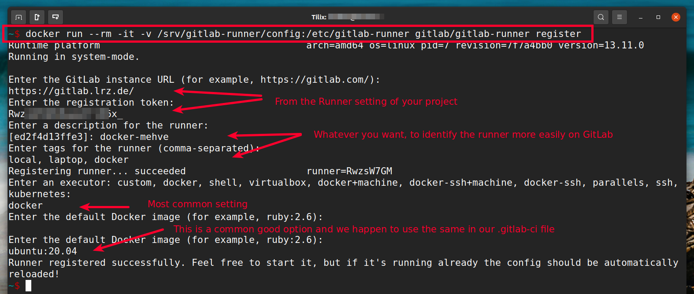

After registering the runner, you may notice that your jobs are still not starting.
We still need to tell our runner to also pick untagged jobs, to be able
to run any commit. For this, go back to your project's runners settings,
click "edit" next to your runner and check the respective option:

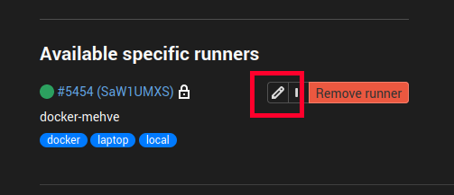

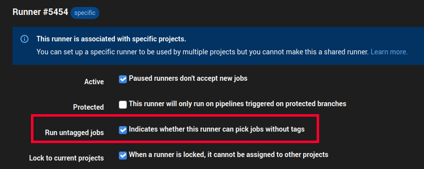

After all this, restart your jobs and keep and maybe refresh the page.
Finally, we now get a nice green mark next to our jobs! 🥳

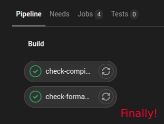

Did the job start but fail? This is good, it means that it works and we need it!
Just click on the job and check the logs to find out what the problem is.
